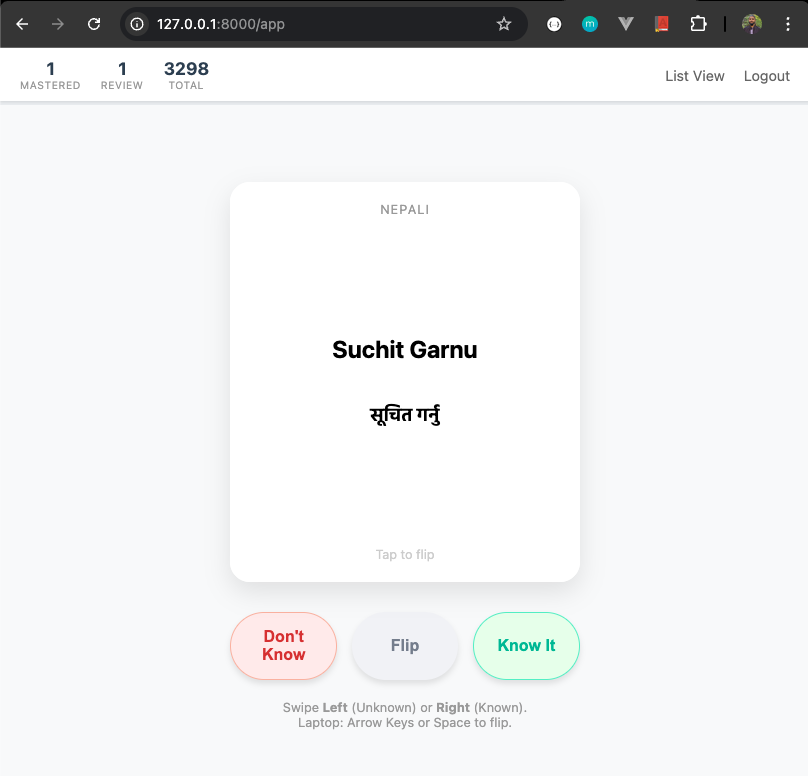
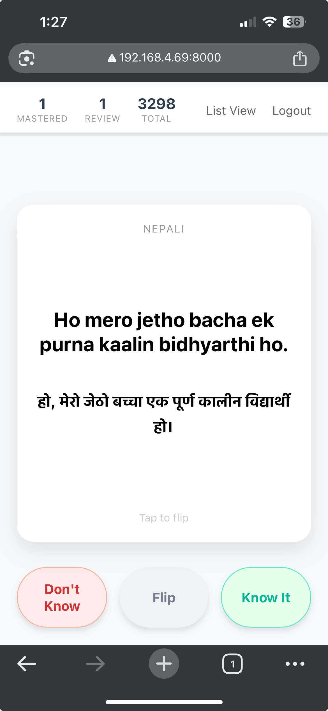

# Prep NAATI - Nepali Vocabulary Flashcards

A lightweight, mobile-responsive web application to practice **NAATI CCL Nepali** vocabulary/dialogues. It features a
swipe-based interface (Tinder-style) to track progress between "Known" and "Unknown" words/Sentences, stored in a local
SQLite database.

## Prerequisites

* **Python 3.12**
* **uv** (An extremely fast Python package installer and resolver)

If you don't have `uv` installed:

```bash
# On macOS/Linux
curl -LsSf [https://astral.sh/uv/install.sh](https://astral.sh/uv/install.sh) | sh

# On Windows
powershell -c "irm [https://astral.sh/uv/install.ps1](https://astral.sh/uv/install.ps1) | iex"
````

## Setup

1. **Prepare Data**
   Ensure the file `NAATI_Vocabulary_Master_List.csv` is in the root directory.

2. **Initialize Environment**
   Sync dependencies using `uv`. This creates the virtual environment and installs Flask for Python 3.12.

   ```bash
   uv sync
   ```

## Running the App

To start the application server:

```bash
uv run python app.py
```

*Note: The first time you run this, it will create `naati_vocab.db` and populate it from your CSV file.*

## Accessing the App

### 💻 On Local Machine (Laptop)

Open your browser and navigate to:
**https://www.google.com/search?q=http://127.0.0.1:8000**

* **Login:** Enter any username (no password required).
* **Controls:**
    * `Spacebar`: Flip Card
    * `Left Arrow`: Mark as Unknown (Review later)
    * `Right Arrow`: Mark as Known



### 📱 On Mobile Phone (Same WiFi)

1. Find your computer's local IP address:

    * **Windows:** `ipconfig` (Look for IPv4 Address)
    * **Mac/Linux:** `ipconfig getifaddr en0` or `hostname -I`

2. On your phone, visit: `http://YOUR_COMPUTER_IP:8000`

3. **Controls:** Swipe Left (Unknown) or Swipe Right (Known).



## Project Structure

* `app.py`: Main Flask application and database logic.
* `pyproject.toml`: Dependency configuration for `uv`.
* `templates/`: HTML files (`index.html`, `login.html`).
* `static/`: CSS styling and JavaScript for swipe logic.
* `naati_vocab.db`: SQLite database (auto-generated).

## Troubleshooting

* **Port Issues:** If port 8000 is busy, edit the bottom of `app.py` to change `port=8000` to `port=8001` or another
  available port.
* **Mobile Connection Refused:** Ensure your computer's firewall allows connections to Python/Flask, and that both
  devices are on the same WiFi network.
